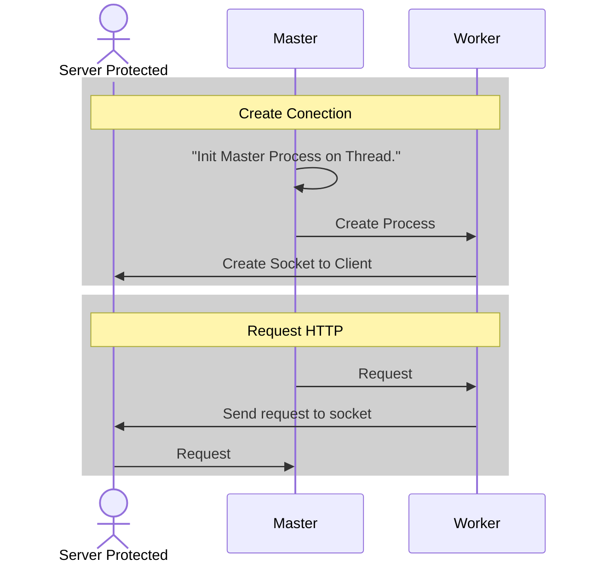

# RPX - Reverse ProXy

This is of project for system and implemented reverse proxy than nginx



## Instalación en Linux

```bash
$ apt install rpx
```

## Instalación en MacOs

```bash
$ brew install rpx
```

Develop Install
-----------
- Cargo

```bash
# make project
$ cargo run --release
$ binlocal -d ../rpx

# run project
$ rpx
```


Commits
-----------
For commits add structured for easy correction and detect issues

```bash
[ADD] Added method of function for correct operation App
[IMP] or [FEAD] Implementation of new part of App

[BUG] Detection and correction of Bugs in code
[FIX] Detection and correction of fixes and future issues
[HOTFIX] Correction issue IMPORTANT!
```

**That was all, thank!** 
- **Authors: Andres Cuello**
