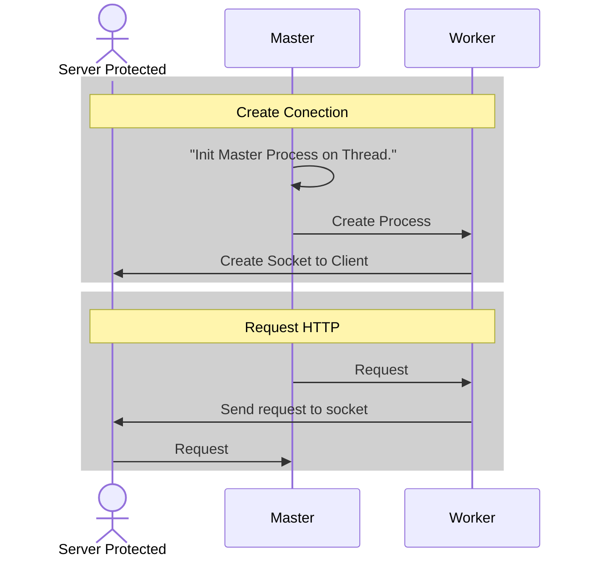

# RPX - Reverse Proxy

RPX is a lightweight reverse proxy system implemented in Rust, designed as an alternative to tools like NGINX.
The main idea is to provide a Master–Worker architecture where the Master process dynamically creates and manages Workers.
Each Worker handles incoming connections and distributes requests efficiently across multiple backend servers.


https://github.com/user-attachments/assets/dab053bd-4e21-46e2-a780-bc84c84466f1


### Architecture Overview

This sample demonstrates how the system initializes and manages communication between the Master, Workers, and Protected Server.



Development
-----------
- Cargo

```bash
# make project
$ cargo run --release
$ binlocal -d ../rpx

# run project
$ rpx
```

Commits
-----------
For commits add structured for easy correction and detect issues

```bash
[ADD] Added method of function for correct operation App
[IMP] or [FEAD] Implementation of new part of App

[BUG] Detection and correction of Bugs in code
[FIX] Detection and correction of fixes and future issues
[HOTFIX] Correction issue IMPORTANT!
```

**That was all, thank!** 
- **Authors: Andres Cuello**

Thank you for checking out RPX!
